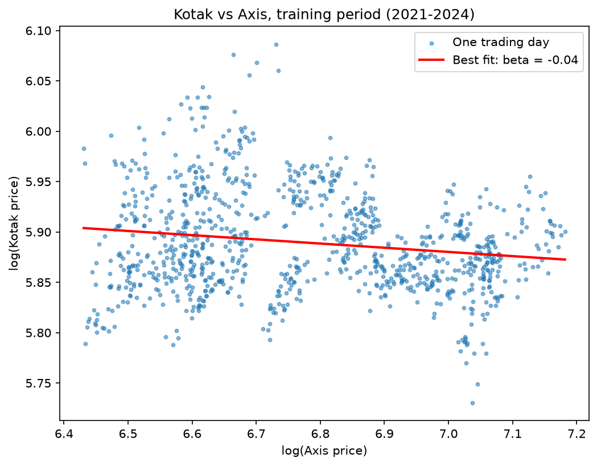
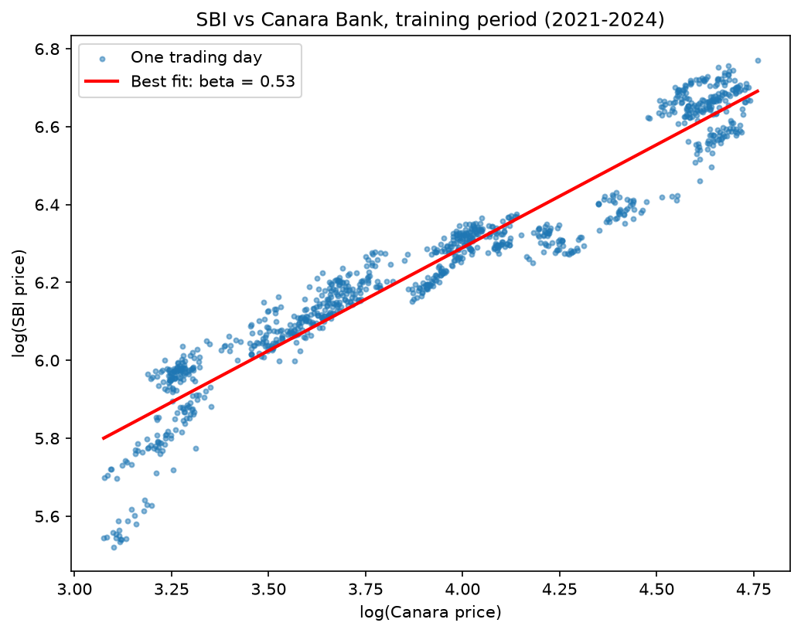
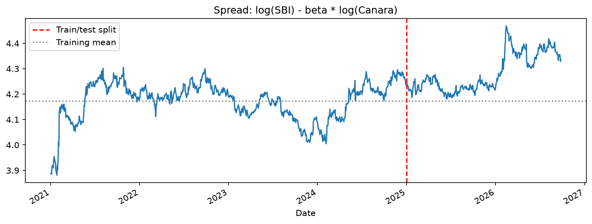
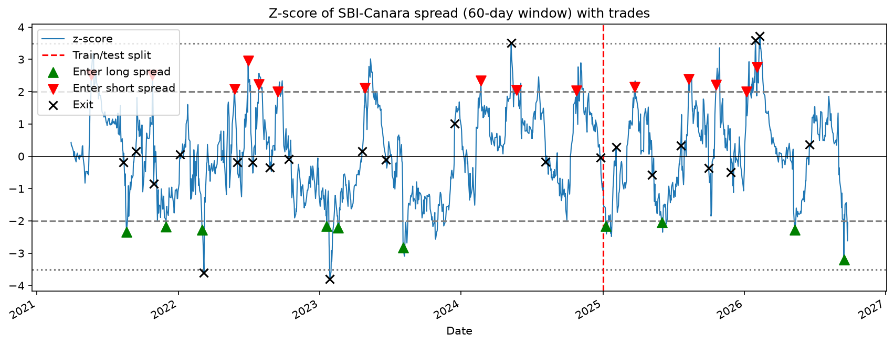
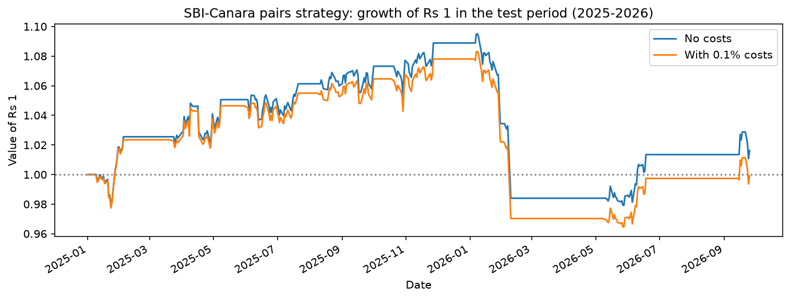

# Pairs Trading on Indian Bank Stocks: SBI vs Canara Bank

A market-neutral statistical arbitrage strategy that trades the price gap between two related stocks, tested honestly on data it never saw during setup.

**Result in one line:** the strategy made steady profits through 2025, lost them in a single episode in early 2026 when the relationship between the stocks shifted, and roughly broke even after trading costs.

## The idea

Some stocks are tied together by their business. SBI and Canara Bank are both large public-sector banks, exposed to the same interest rates, regulation and economy, so their prices tend to move together. When one runs ahead of the other, the strategy bets that the gap will close: it buys the relatively cheap stock and shorts the relatively expensive one.

Because it holds one stock long and the other short, moves that affect both banks roughly cancel out. The strategy only makes or loses money when the gap between them changes.

## Data and setup

- Daily adjusted closing prices from Yahoo Finance (`yfinance`), January 2021 to September 2026.
- **Training period:** 2021 to 2024. Used to choose the pair and estimate every parameter.
- **Test period:** January 2025 to September 2026. Used only to evaluate the strategy, with all parameters frozen.

## Step 1: Choosing a pair

I screened candidate pairs from banking and oil marketing on the training data only, using three checks:

1. **Cointegration test (Engle-Granger):** does the gap between the two stocks reliably pull back to its average? A low p-value suggests it does.
2. **Hedge ratio (beta):** should be clearly positive, meaning the stocks actually move together.
3. **Each stock on its own should *not* be mean-reverting** . Otherwise the pair test can be fooled.

| Pair | Cointegration p | Beta | Stock A alone p | Stock B alone p |
| --- | --- | --- | --- | --- |
| Kotak Bank – Axis Bank | 0.0003 | -0.04 | 0.000 | 0.525 |
| **SBI – Canara Bank** | **0.0106** | **0.53** | **0.236** | **0.699** |
| SBI – Bank of Baroda | 0.0417 | 0.53 | 0.236 | 0.687 |
| HDFC Bank – ICICI Bank | 0.0473 | 0.23 | 0.101 | 0.639 |
| BPCL – HPCL | 0.3552 | 0.73 | 0.843 | 0.934 |
| Bank of Baroda – PNB | 0.5473 | 0.88 | 0.687 | 0.894 |
| PNB – Canara Bank | 0.6542 | 0.92 | 0.894 | 0.699 |
| BPCL – IOC | 0.8125 | 0.62 | 0.843 | 0.733 |
| HPCL – IOC | 0.8807 | 0.86 | 0.934 | 0.733 |

### A trap I fell into first

My first choice was Kotak–Axis, which had by far the lowest cointegration p-value. But its hedge ratio came out at **-0.04**, essentially zero, and the regression chart showed no relationship at all:



The reason: between 2021 and 2024 Kotak was stuck in a price range and kept bouncing back on its own (its standalone p-value is 0.000). The "spread" was really just Kotak's price, so the test passed without Axis contributing anything. I added checks 2 and 3 above to catch this, and SBI–Canara was the only pair that passed all three clearly.

With 9 pairs tested, there is also some chance that one passes purely by luck, so the evidence for SBI–Canara is good but not overwhelming.

## Step 2: The relationship

A regression of log(SBI) on log(Canara) over the training period gives a **hedge ratio of 0.53**: when Canara moves 1%, SBI tends to move about 0.53%. So for every Rs 1 of SBI, the strategy holds Rs 0.53 of Canara on the opposite side.



The **spread** is log(SBI) - 0.53 x log(Canara), the balanced gap between the two stocks:



In training, the spread swings around its average. After the red line (the test period), it drifts upward, and in early 2026 it jumps to a new, higher level: SBI outperformed Canara more than the old relationship predicted.

The spread's **half-life** in training was about **36 trading days**, meaning it typically takes that long to close half its gap to the average. I used about twice this, capped at 60 days, as the look-back window for the z-score.

## Step 3: Trading rules

The **z-score** measures how unusual today's spread is: how many standard deviations it sits from its average over the last 60 days.

- **z above +2:** SBI is expensive relative to Canara, so short the spread (sell SBI, buy Canara).
- **z below -2:** SBI is cheap relative to Canara, so go long the spread (buy SBI, sell Canara).
- **z back to 0:** the gap has closed, so exit.
- **z beyond +/-3.5:** the gap is widening instead of closing, so exit (stop-loss).
- **After a stop-loss:** no new trade until z comes back inside +/-2.

The last rule came from reading the trade log. Without it, the strategy re-entered the same losing trade the day after each stop-loss. A stricter alternative would be to wait until z returns to 0.



## Step 4: Backtest

- Signals use each day's closing price, and positions take effect from the **next** day. You can't trade on a closing price before it exists.
- Returns are measured on gross exposure (both legs combined).
- Trading costs: 0.1% of the value of both legs every time the position changes.



### Results (test period, 2025–2026)

| Version | Return | Sharpe | Max drawdown |
| --- | --- | --- | --- |
| Honest, no costs | +1.63% | 0.17 | -10.58% |
| **Honest, with costs** | **-0.09%** | **0.03** | **-10.95%** |
| Beta fitted on all data (lookahead) | +1.59% | 0.17 | -9.87% |
| No one-day delay (impossible timing) | -8.79% | -0.78 | -11.86% |

### What the results mean

- **The strategy worked until the relationship changed.** It gained about 9% through 2025, then lost about 10% in a few weeks in early 2026 when the spread jumped to a new level and both stop-losses fired. Many small wins followed by one large loss is typical of mean-reversion strategies.
- **Costs matter.** A +1.6% gross return became roughly zero after 0.1% costs.
- **Lookahead bias distorts results, in either direction.** Fitting beta on all the data used knowledge of the future relationship and made results look better. Removing the one-day delay made them much worse: each trade absorbed the very move that triggered it and missed the move that closed it. Neither version could be traded in reality.

## Limitations

- **One pair, a short test period, and few trades,** so the results depend heavily on a handful of outcomes.
- **Relationships can break.** The early-2026 shift shows that a pair that passed in training can stop behaving the same way.
- **Costs are simplified.** 0.1% per leg doesn't include slippage or the price impact of large orders.
- **The relationship isn't perfectly linear.** The regression chart shows a slight curve that a straight line can't capture.

## How to run

```
git clone https://github.com/mystic0196/pairs-trading.git
cd pairs-trading
python -m venv venv
venv\Scripts\activate            # Mac/Linux: source venv/bin/activate
pip install -r requirements.txt
```

Then open `notebooks/analysis.ipynb` and run all cells.